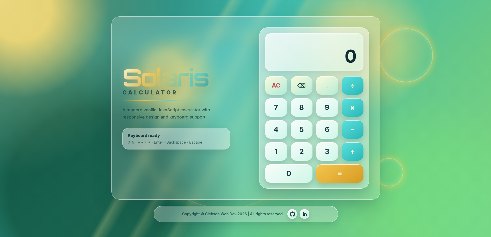

# Solaris Calculator

[Live Demo](https://progritit.github.io/Calculator/)



# SOLARIS CALCULATOR

A modern vanilla JavaScript calculator with responsive design and keyboard support.

This project was developed as part of The Odin Project Foundations curriculum and expanded into a polished browser-based calculator focused on JavaScript logic, application state management, DOM manipulation, keyboard interactions, responsive layout, and clean UI design.

---

## Preview

The application showcases:

* A responsive calculator interface
* Basic arithmetic operations
* Chained calculations
* Decimal input
* Backspace functionality
* Clear/reset functionality
* Division by zero error handling
* Keyboard support
* Dynamic display updates
* Footer with automatically updated copyright year
* Polished solar-inspired visual direction
* CSS-generated background and decorative elements
* Responsive layout for desktop, tablet, and mobile

---

## Built With

* HTML5
* CSS3
* JavaScript
* CSS Grid
* Flexbox
* CSS variables
* DOM manipulation
* Event listeners
* Responsive design
* Git and GitHub
* VS Code
* AI-assisted design and development workflow

---

## Features

### Calculator Logic

* Addition, subtraction, multiplication, and division
* Reusable `operate()` function
* Stores the first number, operator, and second number
* Evaluates one pair of numbers at a time
* Supports chained operations such as `12 + 7 - 1 =`
* Prevents invalid consecutive operator evaluations
* Rounds long decimal results to avoid display overflow
* Shows a custom error message when dividing by zero

### Input Controls

* Digit buttons from `0` to `9`
* Operator buttons: `+`, `−`, `×`, `÷`
* Decimal button
* Equals button
* Clear button
* Backspace button
* Keyboard support for numbers, operators, Enter, Backspace, Escape, and decimal input

### Layout & UI

* Semantic HTML structure
* Glassmorphism-inspired calculator panel
* Large readable display area
* Secondary expression/history line
* Styled number, operator, action, and equals buttons
* Responsive footer with GitHub and LinkedIn links
* Dynamic current year in the footer
* Responsive layout for multiple screen sizes

### Design

* Solar-inspired visual identity
* Subtle eco-futuristic atmosphere
* Warm gold, teal, green, cream, and cyan color palette
* CSS-generated background replacing watermarked visual assets
* Soft shadows, rounded panels, glow effects, and decorative orbs
* Refined title styling using modern font pairing and gradient text
* Visual direction kept subtle rather than explicitly labeled

---

## Project Structure

```
Solaris_Calculator/
│
├── index.html
├── styles.css
├── script.js
├── README.md
├── LICENSE
│
└── media/
    └── preview.png
```

---

## Design Concept

Solaris Calculator was designed as a clean and polished calculator interface with a subtle solar-inspired visual direction.

The goal was to avoid a generic calculator layout while keeping the application realistic, usable, and beginner-friendly. The interface combines foundational front-end development skills with a refined visual identity, creating a project that feels suitable for a junior developer portfolio.

The design is inspired by:

* Clean technology
* Soft sunlight
* Glass-like interface panels
* Eco-futuristic visual language
* Calm gradients and glowing accents
* Responsive product-style interfaces

The objective was not to build an advanced scientific calculator, but to create a complete and elegant browser calculator using HTML, CSS, and vanilla JavaScript fundamentals.

---

## Key Learning Outcomes

This project helped reinforce:

* Writing reusable JavaScript functions
* Managing calculator state with variables
* Handling user input from buttons
* Adding keyboard support
* Updating the DOM dynamically
* Preventing invalid operations
* Handling edge cases such as division by zero
* Working with decimals and display formatting
* Structuring conditional logic clearly
* Creating responsive layouts with CSS Grid and Flexbox
* Using CSS variables for consistent design
* Debugging asset paths and script loading behavior
* Improving UI details through small visual refinements
* Writing clearer commit messages during project development

---

## Challenges Solved

### Calculator State Management

The calculator needed to track the first number, selected operator, second number, current display value, and whether the display should reset after an operation.

### Solution

* Created dedicated state variables
* Used separate functions for number input, operator selection, evaluation, clearing, and backspace
* Updated the display based on the current state of the calculator

---

### Chained Operations

The calculator needed to evaluate expressions progressively instead of calculating a full equation at once.

Example:

```
12 + 7 - 1 = 18
```

### Solution

* Evaluated the first pair of numbers when a second operator is selected
* Stored the result as the new first number
* Continued the next operation using the previous result

---

### Consecutive Operators

Pressing operator buttons repeatedly should not trigger incorrect calculations.

### Solution

* Detected when the display was waiting for the next number
* Replaced the selected operator instead of evaluating an incomplete operation

---

### Display Spacing

The right-aligned display value appeared too close to the display border and slightly clipped some numbers.

### Solution

* Added right padding to the display value
* Adjusted letter spacing for improved readability

---

### Background Asset Integration

An AI-generated background image was visually strong but contained a visible watermark.

### Solution

* Recreated the general atmosphere using CSS gradients, pseudo-elements, and decorative orbs
* Removed dependency on the watermarked image
* Improved ownership, performance, and portfolio presentation

---

## AI-Assisted Workflow

This project was developed using a modern AI-assisted workflow.

### ChatGPT

Assisted with:

* Project planning
* HTML and CSS structure
* JavaScript calculator logic
* Debugging layout and display issues
* Responsive design improvements
* Footer implementation
* Commit message suggestions
* README drafting
* Portfolio presentation refinement

### Google Gemini

Assisted with:

* Visual direction exploration
* Initial app mockup generation
* Solar-inspired design references

### Development Approach

AI tools were used as collaborative assistants throughout the project. Implementation decisions, manual testing, debugging, code integration, and final design choices were handled directly by the developer.

This workflow reflects a modern learning process where AI supports ideation and problem-solving while the developer remains responsible for understanding, adapting, testing, and refining the final result.

---

## Future Improvements

Potential future enhancements:

* Add calculation history
* Add copy result functionality
* Add light/dark theme toggle
* Add improved accessibility testing
* Add custom favicon
* Add unit tests for calculator logic
* Add optional percentage operation
* Add smoother button press animations
* Add GitHub Pages deployment link
* Add a final project screenshot

---

## Author

Clebson Costa

Full Stack Web Development student.

Current areas of study and practice:

* HTML
* CSS
* JavaScript fundamentals
* DOM manipulation
* Responsive layouts
* Git and GitHub
* UI implementation
* Portfolio-quality projects

Long-term learning path:

* Frontend development
* Backend development
* Databases
* Full stack application architecture

---

## Acknowledgements

* The Odin Project
* ChatGPT for development support and debugging assistance
* Google Gemini for visual direction exploration
* The open web development community

---

## License

This project is open-source and available for educational and portfolio purposes.
